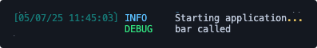
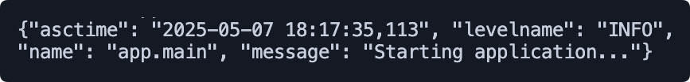

# Python base

## Description

This is a base repository for Python projects. It provides a set of tools and libraries to help you get started quickly.
It is designed to follow the best practices and conventions of Python development.

## How to use

This repository is a base for Python projects. It provides a set of tools and libraries to help you get started quickly.

This repository assumes that python modules are semantically divided into two categories: Applications and Libraries.

Applications are the main entry point of the project. They are executed directly and are responsible for running the application. Applications can be standalone (like a CLI app) or a module (like an API).

Libraries are the reusable components of the project. It is recommended to put as much application logic into specialized libraries as possible. Libraries are imported by applications and are not executed directly.

## Features

### Logging configuration for local and production environments

When running the application, logging has different configurations depending on the environment.

When running locally, the logging are configured to be easy to read by a human. This means that the logs are well formatted (e.g. colors, indentation, etc.).
Logs for the local environment are set to DEBUG level, which means that all logs are printed.

When running in production, the logging are configured to be easy to read by a machine. This means that the logs are printed in a single line and are formatted in JSON.
This way, it can be better be handled by cloud providers (e.g. AWS, GCP, etc.) and log management tools (e.g. ELK, Splunk, etc.).
Logs for the production environment are set to INFO level, which means that only logs with level INFO and above are printed.

| Development | Production |
| ----------- | ---------- |
|  |  |

#### Use the logs

To use the logs, you can import the `get_logger` function and call it to get the logger.

```python
from logging import get_logger

logger = get_logger(__name__)
logger.debug("This is a debug message")
```

### App settings management

The application settings are managed using [pydantic-settings](https://pydantic-docs.helpmanual.io/usage/settings.html).

As a result, the application settings are loaded from environment variables and/or a `.env` file.

A base settings class is provided in `src/core/settings/` module. Each application can extend this class and define its own settings.

#### Define the settings

Each application must define its own settings and should define a `get_settings` function that returns the settings.

```python
from functools import lru_cache
from core.settings import AppBaseSettings

class Settings(AppBaseSettings):
    pass

@lru_cache()
def get_settings() -> Settings:
    return Settings()  # type: ignore
```

Since the settings are defined application-wise, each libraries must have their way of defining settings.

To do so, each library can define its own specialized settings class (e.g. `LogsSettings`, `BigQueryTableSettings`, etc.). Then, each application that will use the library must include the settings in its own settings class.

```python
from core.settings import AppBaseSettings
from core.genai import GenAISettings

class Settings(AppBaseSettings):
    genai: GenAISettings = GenAISettings()
```

#### Use the settings

To use the settings, you can import the `get_settings` function and call it to get the settings.

However, while a cached function (acting as a singleton) is useful to access the settings, it can be problematic when testing the application.

To avoid this, it is recommended to pass the settings as a parameter to the function that needs it. This way, you can easily mock the settings in your tests.

```python
from app.settings import get_settings, Settings

def main(*, settings: Settings = get_settings()) -> None:
    pass
```

For libraries, the same approach can be used. It is particularly useful when the library is used in multiple applications or when functions can be used with different settings within the same application.

```python
# In the library
from core.bigquery import BigQueryTableSettings

def count_rows(bigquery_table: BigQueryTableSettings) -> int:
    ...
    
# In the application
from core.settings import AppBaseSettings
from core.bigquery import BigQueryTableSettings

class Settings(AppBaseSettings):
    input_bigquery: BigQueryTableSettings = BigQueryTableSettings()
    output_bigquery: BigQueryTableSettings = BigQueryTableSettings()

def main(*, settings: Settings = get_settings()) -> None:
   output_row_count = count_rows(bigquery_table=settings.output_bigquery)
```


## Develop

### Install dependencies

```bash
uv sync --all-groups --all-extras
```

### Run the application

Running the application depends on the project.

#### Run a standalone project

A standalone project is a project that is executed directly (e.g. `python main.py`).

To do so, you must make sure that a script is defined in the `pyproject.toml` file.

For example, to run that `main` function in the `src/app/main.py` file, you must have the following in your `pyproject.toml` file:

```toml
[project.scripts]
app = "app.main:main"
```

Then, you can run the application with:

```bash
uv run app
```

#### Run a module

A module is a project that is executed as a module (e.g. `fastapi dev src/api`).

You can run the module with:

```bash
uv run fastapi dev src/api
```

### Run development commands

A makefile is provided to run the development commands.
The makefile is a simple way to run the commands without having to remember the exact command.

To see what commands are executed, you can look at the `Makefile` file.

#### Run tests

```bash
make test
```

#### Run linter

```bash
# Check command
make lint
# Autofix command
make lint-fix
make lx
```

#### Run formatter

```bash
# Check command
make format
# Autofix command
make format-fix
make fx
```

## Build

A [Dockerfile](./Dockerfile) is provided to build the project.

The Dockerfile works by installing the dependencies and the project in a virtual environment in a builder image. Then, it copies the virtual environment to a new image and runs the application.

When looking at the Dockerfile, you will see that the content of this repository is not copied to the final image. This is because the Dockerfile uses a multi-stage build, which allows you to copy only the necessary files from the builder image to the final image.

This way, the final image is smaller and only contains the dependencies and the project.

Then, each application extends the base image and defines its own entrypoint and or environment.

### Build the image

```bash
docker build \
    --target app \
    -t <image-name> \
    .
```
